# Moon-Link Discord MCP Server 🌕🔗

[](https://modelcontextprotocol.io/)
[](https://www.typescriptlang.org/)
[](https://nodejs.org/)
[](https://discord.js.org/)
[](https://developers.cloudflare.com/cloudflare-one/connections/connect-apps/)
[](tests/security.test.ts)
[](LICENSE)

A high-performance, enterprise-grade **Model Context Protocol (MCP)** server built with TypeScript, Node.js, and Discord.js v14. Designed to securely integrate Discord administration, server management, and conversational automation with remote AI clients (such as **Google Gemini Spark**, **Claude Desktop**, **Antigravity**, **Cursor**, and custom LLM agents).

---

## 🌟 Key Highlights

- **Dual-Protocol Transport (Hybrid SSE + Streamable HTTP)**:
  - Supports both classic **Server-Sent Events (SSE)** (`GET /sse`, `POST /messages`) and modern **Streamable HTTP JSON-RPC** (`POST /sse`, `POST /mcp`, `POST /`).
  - Compatible with all MCP client generations without configuration changes.
- **Optimized for Google Gemini Spark & Remote Web Clients**:
  - Implements **RFC 9470 OAuth 2.0 Protected Resource Metadata** (`/.well-known/oauth-protected-resource`) for automated client discovery.
  - Instant `HEAD` response handlers for remote reachability validation.
  - Automatic `Accept` header normalization to guarantee Streamable HTTP compatibility.
- **Zero-Inbound-Port Cloudflare Tunnel Architecture**:
  - Operates locally on `127.0.0.1:3000` behind a Cloudflare Tunnel (`cloudflared`).
  - No raw public ports exposed to internet port scanners; traffic is protected by Cloudflare Edge TLS 1.3 and DDoS mitigation.
- **Enterprise Security Guardrails**:
  - **Timing-Safe Authentication**: Constant-time token verification (`crypto.timingSafeEqual`) eliminates side-channel timing attacks.
  - **Log Sanitization**: Auth tokens in query parameters are automatically masked in system logs (`?token=c3fe...82a3`).
  - **DDoS & Brute-Force Rate Limiting**: Built-in `express-rate-limit` (180 req/min per IP) with proxy trust for Cloudflare headers.
  - **Guild Boundary Whitelisting**: Strict `ALLOWED_GUILD_IDS` prevents unauthorized interaction with servers outside the whitelist.
  - **Destructive Action Confirmations**: High-impact operations (`delete_channel`, `kick_member`, `ban_member`, `delete_role`) require explicit `confirm: true`.
  - **Role & Member Hierarchy Protection**: Prevents AI agents from modifying the server owner, itself, or roles higher than the bot.
  - **Snowflake ID Validation**: All Discord IDs are strictly validated with `^\d{17,20}$`.
- **27 Discord Tools & 3 MCP Resources**: Complete coverage of server inspection, channel administration, role management, messaging, moderation, and audit logs.

---

## 🏗️ Architecture Overview

```mermaid
flowchart LR
    subgraph Clients["Remote MCP Clients"]
        Spark["Google Gemini Spark"]
        Claude["Claude Desktop / CLI"]
        Custom["Custom LLM Agents"]
    end

    subgraph Edge["Cloudflare Edge Network"]
        CFTunnel["Cloudflare Tunnel (TLS 1.3)"]
    end

    subgraph Host["Secure Host Environment (AWS / Linux)"]
        Daemon["cloudflared daemon"]
        Loopback["127.0.0.1:3000 (Node.js)"]
        
        subgraph Server["Moon-Link Core"]
            Auth["Token Auth (timingSafeCompare)"]
            RateLimit["Rate Limiter (180/min)"]
            Router["Hybrid Transport Router"]
            SSE["SSEServerTransport"]
            Streamable["StreamableHTTPServerTransport"]
            SecGuard["Security Guardrails"]
            DiscordBot["Discord.js v14 Gateway"]
        end
    end

    subgraph DiscordCloud["Discord API"]
        Gateway["Discord Gateway & REST API"]
    end

    Spark -->|HTTPS / WSS| CFTunnel
    Claude -->|HTTPS / Stdio| CFTunnel
    Custom -->|HTTPS| CFTunnel
    CFTunnel --> Daemon
    Daemon --> Loopback
    Loopback --> Auth
    Auth --> RateLimit
    RateLimit --> Router
    Router -->|GET /sse| SSE
    Router -->|POST /sse| Streamable
    SSE --> SecGuard
    Streamable --> SecGuard
    SecGuard --> DiscordBot
    DiscordBot --> Gateway
```



---

## 📋 Available MCP Tools (27 Tools)

### 🏰 Server & Member Inspection
| Tool Name | Parameters | Description |
| :--- | :--- | :--- |
| `get_server_info` | `[guild_id]` | Comprehensive server statistics (channels, roles, members, boost level, owner). |
| `list_channels` | `[guild_id]` | List all channels categorized by text, voice, category, forum, position, and topic. |
| `list_roles` | `[guild_id]` | List all roles ordered by position hierarchy with permissions, color, and member counts. |
| `list_members` | `[limit, query, role_id, guild_id]` | Search, paginate, and filter members by name or role. |
| `get_member` | `user_id, [guild_id]` | Inspect member profile, roles, permissions, join dates, and moderation status. |

### 💬 Messaging & Threads
| Tool Name | Parameters | Description |
| :--- | :--- | :--- |
| `send_message` | `channel_id, content, [embed, reply_to_message_id, guild_id]` | Send rich messages, embeds (title, color, fields), or replies. |
| `read_channel_messages` | `channel_id, [limit, before, after, guild_id]` | Retrieve recent channel messages with author, attachments, and reactions. |
| `delete_message` | `channel_id, message_id, [reason, guild_id]` | Delete a specific message by ID. |
| `purge_messages` | `channel_id, amount, [confirm, reason, guild_id]` | Bulk delete messages younger than 14 days (*Requires `confirm: true`*). |
| `add_reaction` | `channel_id, message_id, emoji, [guild_id]` | Add standard Unicode or custom Discord emoji reactions. |
| `create_thread` | `channel_id, name, [auto_archive_duration, message_id, guild_id]` | Create public or message-attached discussion threads. |

### 🛠️ Channel Administration
| Tool Name | Parameters | Description |
| :--- | :--- | :--- |
| `create_channel` | `name, [type, topic, parent_category_id, rate_limit_per_user, nsfw, reason, guild_id]` | Create text, voice, announcement, or category channels. |
| `modify_channel` | `channel_id, [name, topic, parent_category_id, rate_limit_per_user, nsfw, reason, guild_id]` | Modify channel settings, slowmode, category, and metadata. |
| `delete_channel` | `channel_id, [confirm, reason, guild_id]` | Permanently delete a channel or category (*Requires `confirm: true`*). |

### 👥 Role Management
| Tool Name | Parameters | Description |
| :--- | :--- | :--- |
| `assign_role` | `user_id, role_id, [reason, guild_id]` | Assign a role to a server member (*Hierarchy validated*). |
| `remove_role` | `user_id, role_id, [reason, guild_id]` | Remove a role from a member (*Hierarchy validated*). |
| `create_role` | `name, [color_hex, hoist, mentionable, reason, guild_id]` | Create a new role with customizable color and flags. |
| `delete_role` | `role_id, [confirm, reason, guild_id]` | Permanently delete a role (*Hierarchy validated, requires `confirm: true`*). |

### 🛡️ Moderation & Safety
| Tool Name | Parameters | Description |
| :--- | :--- | :--- |
| `timeout_member` | `user_id, duration_minutes, [reason, guild_id]` | Temporarily timeout (mute) a member (up to 28 days / 40,320 mins). |
| `remove_timeout` | `user_id, [reason, guild_id]` | Remove an active timeout from a member. |
| `kick_member` | `user_id, [confirm, reason, guild_id]` | Kick a member with audit log reason (*Hierarchy validated, requires `confirm: true`*). |
| `ban_member` | `user_id, [confirm, delete_message_days, reason, guild_id]` | Ban a user from the server (*Hierarchy validated, requires `confirm: true`*). |
| `unban_member` | `user_id, [reason, guild_id]` | Unban a previously banned user by ID. |
| `list_bans` | `[limit, guild_id]` | List banned users and their logged ban reasons. |

### 📜 Invites & Audit Logs
| Tool Name | Parameters | Description |
| :--- | :--- | :--- |
| `create_invite` | `channel_id, [max_age_seconds, max_uses, unique, reason, guild_id]` | Generate custom invite links with expiration and usage caps. |
| `list_invites` | `[guild_id]` | List all active invite links for the server. |
| `get_audit_logs` | `[limit, user_id, guild_id]` | Inspect recent moderation and administrative action logs. |

### 📦 MCP Resources
- `discord://server/overview`: Live JSON payload of server metrics, member counts, and configurations.
- `discord://channels/list`: Complete channels list resource.
- `discord://roles/list`: Complete roles list resource with permissions.

---

## 🚀 Installation & Setup

### 1. Prerequisites
- **Node.js**: v20.x or higher
- **Discord Bot Application**: Create one in the [Discord Developer Portal](https://discord.com/developers/applications).

### 2. Discord Bot Configuration
1. Under **Bot > Privileged Gateway Intents**, enable:
   - ✅ **Server Members Intent**
   - ✅ **Message Content Intent**
2. Under **OAuth2 > URL Generator**:
   - Scopes: `bot`, `applications.commands`
   - Permissions: `Administrator` (or granular: Manage Channels, Manage Roles, Kick Members, Ban Members, Moderate Members, Send Messages, Read Message History, View Audit Log).
3. Invite the bot to your private Discord server.

### 3. Clone & Install
```bash
git clone https://github.com/deonetwo/moon-link.git
cd moon-link
npm install
```

### 4. Configure Environment Variables
Create your secure configuration:
```bash
cp .env.example .env
chmod 600 .env
nano .env
```

Set the following parameters:
```ini
# Discord Credentials
DISCORD_BOT_TOKEN=your_bot_token_here
DISCORD_GUILD_ID=your_private_server_id_here
ALLOWED_GUILD_IDS=your_private_server_id_here

# Security Guardrails
REQUIRE_CONFIRMATION=true
MAX_MESSAGE_HISTORY=100

# MCP Transport Configuration
MCP_TRANSPORT=sse
MCP_PORT=3000
MCP_HOST=127.0.0.1

# Generate a strong 256-bit token (e.g. openssl rand -hex 32)
MCP_AUTH_TOKEN=your_secure_random_token_here
```

### 5. Build & Test
```bash
npm run build
npm test
```
All 10 automated security and architecture tests will execute and pass.

---

## 🌐 Connecting MCP Clients

### Option A: Google Gemini Spark (Remote HTTPS over Cloudflare Tunnel)

1. **Start the MCP server**:
   ```bash
   sudo systemctl start moon-link
   ```
2. **Start the Cloudflare Tunnel**:
   ```bash
   sudo systemctl start cloudflared-quick
   ```
   Retrieve your tunnel URL:
   ```bash
   sudo journalctl -u cloudflared-quick -n 30 --no-pager | grep -E "https://[a-zA-Z0-9-]+\.trycloudflare\.com"
   ```
3. **Connect in Gemini Spark**:
   Paste the full URL with the authentication token:
   ```text
   https://<your-tunnel-subdomain>.trycloudflare.com/sse?token=<MCP_AUTH_TOKEN>
   ```
   Gemini Spark will automatically:
   - Probe reachability via `HEAD /sse` (Returns `200 OK`)
   - Discover OAuth metadata via `GET /.well-known/oauth-protected-resource` (Returns `200 OK`)
   - Initialize JSON-RPC session via `POST /sse` (Returns `200 OK`)
   - Discover all 27 tools via `POST /sse [method: tools/list]` (Returns `200 OK`)

---

### Option B: Claude Desktop (Local / Stdio Mode)

In your `claude_desktop_config.json`:
```json
{
  "mcpServers": {
    "moon-link-discord": {
      "command": "node",
      "args": ["/absolute/path/to/moon-link/dist/index.js"],
      "env": {
        "DISCORD_BOT_TOKEN": "your_bot_token_here",
        "DISCORD_GUILD_ID": "your_server_id_here",
        "ALLOWED_GUILD_IDS": "your_server_id_here",
        "MCP_TRANSPORT": "stdio",
        "REQUIRE_CONFIRMATION": "true"
      }
    }
  }
}
```

---

## 💬 Example Test Prompts for AI Agents

Once connected in Gemini Spark or Claude Desktop, test with these prompts:

### 1. Server Inspection (Read-Only)
> *"Check the Discord server info and summarize all categories and active channels."*

### 2. Live Messaging
> *"Send a message to `#general` saying: '🚀 Testing Moon-Link Discord MCP! Everything is operational.'"*

### 3. Message History Reading
> *"Read the last 5 messages from the `#announcements` channel and summarize them."*

### 4. Moderation & Audit Logs
> *"Show me the latest 5 entries from the server's audit logs."*

### 5. Destructive Action Guardrail Test
> *"Delete the channel `#test-channel`"*  
> *(The bot will safely reject the request and prompt you to supply `confirm: true` before executing).*

---

## 🛠️ Production Daemon Management (Systemd)

To keep both the MCP server and Cloudflare Tunnel running 24/7 with automatic restart on crash or reboot:

```bash
# Manage Moon-Link MCP Daemon
sudo systemctl start moon-link
sudo systemctl stop moon-link
sudo systemctl restart moon-link
sudo systemctl status moon-link

# Manage Cloudflare Tunnel Daemon
sudo systemctl start cloudflared-quick
sudo systemctl stop cloudflared-quick
sudo systemctl restart cloudflared-quick
sudo systemctl status cloudflared-quick

# View Live Logs (Tokens are automatically sanitized)
sudo journalctl -u moon-link -f
```

---

## 🧪 Security & Verification Test Suite

Run the comprehensive test suite verifying guardrails, hierarchy, and transport compliance:

```bash
npm test
```

Test suite coverage:
1. `validateSnowflake`: Prevents SQL/command injection and malformed ID attacks.
2. `resolveGuildId`: Strict guild boundary isolation (`ALLOWED_GUILD_IDS`).
3. `enforceConfirmation`: Destructive double-confirmation (`confirm: true`).
4. `validateMemberHierarchy`: Server owner and higher role protection.
5. `validateRoleHierarchy`: Managed roles and `@everyone` mutation protection.
6. `createMcpServer`: Complete tool & resource registration verification.
7. `timingSafeCompare`: Constant-time authentication comparison.
8. `formatDiscordApiError`: Graceful error formatting (rate limits, missing permissions).
9. `StreamableHTTPServerTransport`: Stateless JSON-RPC message processing.
10. `RFC 9470 Metadata`: OAuth 2.0 Protected Resource discovery schema.

---

## 📄 License

This project is licensed under the MIT License - see the [LICENSE](LICENSE) file for details.
